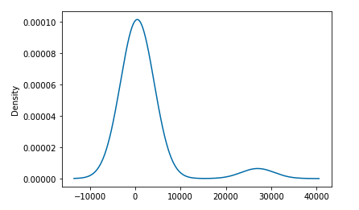
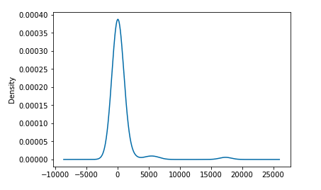
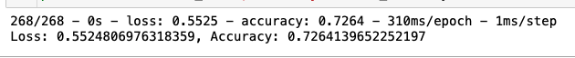
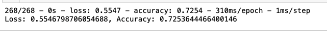

##Neural_Network_Charity_Analysis

###Overview

Create a binary classifier that is capable of predicting whether applicants will be successful if funded by Alphabet Soup

*	Github

###Results

*  Data Preprocessing

	variable(s) use in Model.
	* INCOME_AMT
	* AFFILIATION
	* ORGANIZATION
	* USE_CASE
	* APPLICATION_TYPE
	 
	* CLASSIFICATION
	 
	
	
		
	
	Feature used in Model.
	
	* APPLICATION_TYPE
	* INCOME_AMT
	* CLASSIFICATION
	* SPECIAL_CONSIDERATIONS
	

    What variable(s) are neither targets nor features, and should be removed from the input data?
    

 Compiling, Training, and Evaluating the Model

   Used three layers
   
   * Layer one had 10 neurons, ran the model with "tanh" and "Relu" - No change
   * Layer two had 5 neurons, ran the model with "tanh" and "Relu" - No change
   * Layer three had 10 neurons, ran the model with "relu and "sigmoid" - No change 
   
   
   
  

###Summary

Ran the model many diffrent ways, ran with three layers, with diffrent activation types. Reduced the number of neurons, and epoch. with very little change in accuracy and loss.  